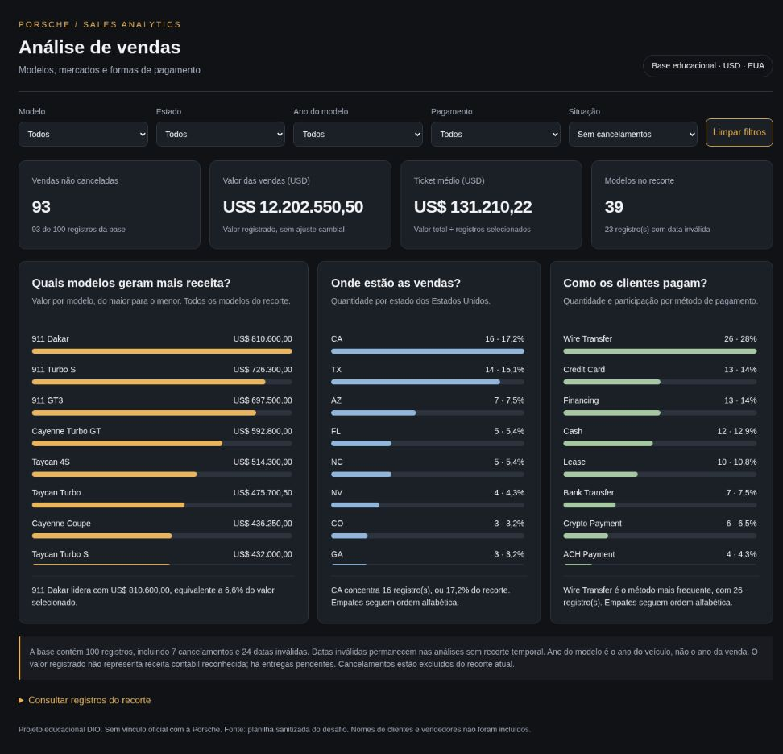
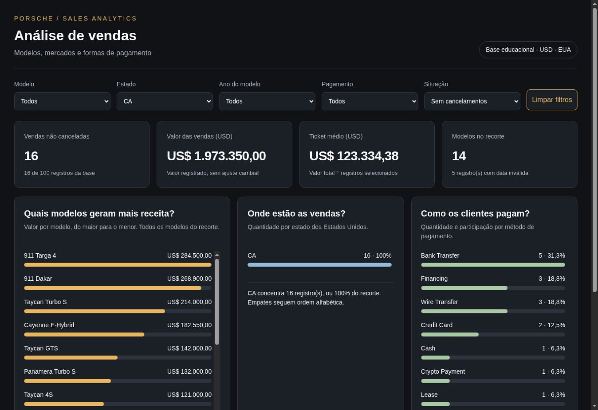

# Dashboard de vendas Porsche

Dashboard interativa criada para o desafio DIO, a partir de 100 registros de vendas da Porsche. O painel é um único arquivo HTML, com dados, CSS e JavaScript embutidos. Funciona no navegador sem bibliotecas externas.

## Perguntas de negócio

| Pergunta | Visualização | Motivo |
| --- | --- | --- |
| Quais modelos geram mais receita? | Barras do valor registrado por modelo | Identificar os modelos com maior contribuição para o valor total. |
| Quais estados concentram mais vendas? | Barras de quantidade por estado | Comparar os mercados presentes na base. |
| Como as vendas se distribuem entre os métodos de pagamento? | Barras de quantidade e participação | Entender o perfil de pagamento dos registros. |

A expressão receita na pergunta refere-se ao valor de venda registrado na base, e não à receita contábil reconhecida. Há registros com entrega pendente. Os dados são educacionais e não devem ser apresentados como um relatório oficial da Porsche.

## Indicadores e filtros

Indicadores: quantidade de registros, valor total em USD, ticket médio e quantidade de modelos distintos. O ticket médio usa o mesmo conjunto de registros do valor total e da quantidade. Em um recorte vazio, aparece como indisponível.

Filtros: modelo, estado, ano do modelo, método de pagamento e situação (sem cancelamentos, todos ou somente cancelamentos). Todos os indicadores, gráficos, conclusões e a tabela de detalhes respondem ao mesmo recorte. O botão Limpar filtros restaura o estado inicial.

## Tratamento da base

Fonte: [planilha sanitizada do desafio DIO](https://hermes.dio.me/files/assets/8683bed0-cc33-4e06-bca9-04db9c31f9e2.xlsx), aba `Sanitized`.

Foram selecionadas apenas as versões sanitizadas de modelo, ano do modelo, preço, cidade, estado, pagamento, data da venda e situação da entrega. Preço foi convertido em número decimal; ano do modelo, em inteiro. Os arquivos tratados contêm valores, sem fórmulas. Os nomes de clientes e vendedores, identificadores e campos brutos não foram incluídos no conjunto publicado.

As 24 datas `INVALID` foram convertidas em nulo no JSON e célula vazia no CSV. Elas permanecem nas análises que não dependem de datas. Nenhuma data foi inventada. Ano do modelo é o ano do veículo, não o ano da venda. A base inclui datas de 2024 a 2027, incluindo datas posteriores à elaboração do projeto; elas foram preservadas como dados do exercício.

Os 7 cancelamentos permanecem na base tratada e são excluídos por padrão. O filtro permite inspecioná-los separadamente. Cada linha conta como um registro de venda; não há coluna de quantidade de veículos. Os preços originais estão em dólares americanos, sem conversão para reais. As siglas de estado se referem aos Estados Unidos.

## Conferência dos valores

| População | Registros | Valor registrado (USD) |
| --- | ---: | ---: |
| Toda a base | 100 | 12.827.800,50 |
| Sem cancelamentos (padrão) | 93 | 12.202.550,50 |
| Cancelamentos | 7 | 625.250,00 |

Ticket médio inicial: US$ 131.210,22.

## Ferramenta e prompts

Foi utilizado ChatGPT no modo Work/Codex para inspecionar os dados e implementar o HTML. O projeto não foi criado no Canvas e não houve comparação com um agente personalizado. O segundo caminho do curso é opcional.

O briefing consolidado, os refinamentos e o registro fiel das ferramentas utilizadas estão em [PROMPTS.md](PROMPTS.md). A preparação da base foi executada por código, sem edição manual no Excel.

## Materiais do curso e rastreabilidade

Os materiais complementares do curso **Criando Agentes de Tratamento de Dados** foram consultados na plataforma DIO. Eles identificam a base crua, a base sanitizada, o script Python e o arquivo de regras. O script original do curso foi incluído sem tradução de comandos em [sanitize_porsche.py](sanitize_porsche.py), e as regras em [schema.md](schema.md). Esses dois arquivos são materiais de apoio fornecidos pelo curso, não código autoral deste projeto.

Fontes originais: [script Python](https://hermes.dio.me/files/assets/a794863f-4c9d-4173-bf0e-fb6f9145fb00.py) e [schema](https://hermes.dio.me/files/assets/c76fa378-efa4-40a7-91ec-ebac746d22d3.md).

A conferência aplicou as nove funções de sanitização aos 100 registros da base crua e comparou os 900 resultados com a base tratada: **zero divergências**. Também confirmou a preservação das colunas originais e a inserção de cada coluna sanitizada imediatamente após sua fonte. O resultado, sem nomes de pessoas, está em [relatorio_tratamento.json](relatorio_tratamento.json).

Para reproduzir a conferência, instale os requisitos e informe os arquivos originais baixados dos materiais DIO:

```bash
python -m pip install -r requirements.txt
python auditar_base.py BASE_CRUA.xlsx BASE_SANITIZADA.xlsx
```

Para atualizar a dashboard com uma planilha sanitizada:

```bash
python preparar_dashboard.py BASE_SANITIZADA.xlsx
```

O comando atualiza `index.html`, `dados_sanitizados.csv` e `dados_sanitizados.json`. Ele rejeita preço ou ano inválido, mantém datas `INVALID` como nulo e impede que valores externos encerrem a tag de script do HTML. Antes de republicar uma base nova, confira os resultados e atualize os totais de referência deste README. A planilha de entrada permanece intacta.

Não é necessário executar o script de higienização original novamente para abrir o painel: a base já tratada está embutida no HTML. As planilhas originais ficam fora do repositório público porque incluem nomes de clientes e vendedores.

## Visual

Fundo grafite, painéis escuros e destaque dourado. As barras de estados são azuis e as de pagamento, verdes. Tipografia Arial/Helvetica disponível no sistema. Valores exatos aparecem como texto junto às barras, evitando dependência exclusiva da cor. O layout se adapta a celular e computador.

## Executar

Abra [index.html](index.html) no navegador. Não é necessário instalar dependências. A base está embutida no HTML; os arquivos CSV e JSON documentam o conjunto tratado.

## Publicação

Dashboard publicada: [abrir painel](https://joseelizeudacosta123-sys.github.io/dashboard-porsche-vendas/).

Repositório público para submissão: [dashboard-porsche-vendas](https://github.com/joseelizeudacosta123-sys/dashboard-porsche-vendas).

GitHub Pages configurado na branch `main`, pasta raiz. Publicação e execução verificadas em 7 de outubro de 2026.

### Evidências



Exemplo: Estado = CA e Situação = Sem cancelamentos. Resultado: 16 registros, US$ 1.973.350,00, ticket médio US$ 123.334,38 e 14 modelos.



Veja [PUBLICAR.md](PUBLICAR.md) para criar o repositório público e ativar Pages. Para submeter o desafio, use o endereço do repositório na sua própria conta.

## Arquivos

- `index.html`: painel completo em arquivo único.
- `dados_sanitizados.csv`: dados tratados, com preços e anos numéricos.
- `dados_sanitizados.json`: os mesmos registros em formato estruturado.
- `PROMPTS.md`: briefing, refinamentos e ferramentas usadas.
- `PUBLICAR.md`: instruções de publicação.
- `README.md`: perguntas, tratamento e documentação.
- `schema.md`: regras originais de sanitização do curso.
- `sanitize_porsche.py`: script original de apoio do curso.
- `auditar_base.py`: conferência reproduzível das duas planilhas.
- `preparar_dashboard.py`: atualização da base pública e do HTML.
- `relatorio_tratamento.json`: resultado da conferência dos 900 campos.
- `requirements.txt`: dependência dos scripts Python.
- `VALIDACAO.md`: testes executados e limites da verificação.

## Créditos

Base fornecida no desafio DIO. Projeto educacional sem vínculo oficial com Porsche. A planilha original, que contém nomes de pessoas, não foi incluída no pacote público.
